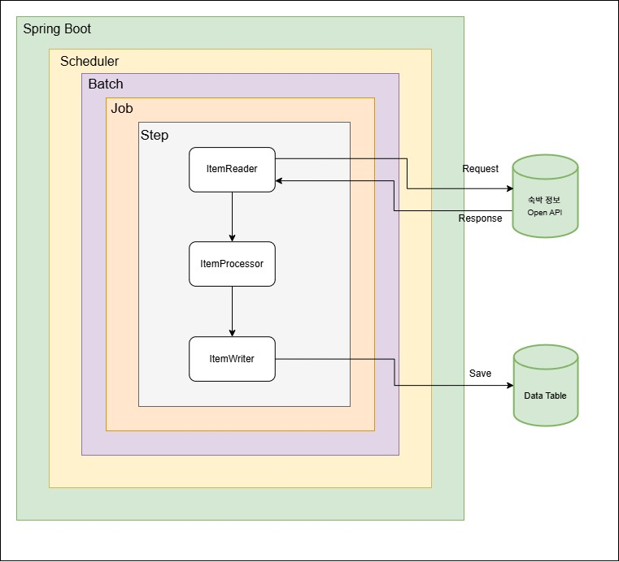
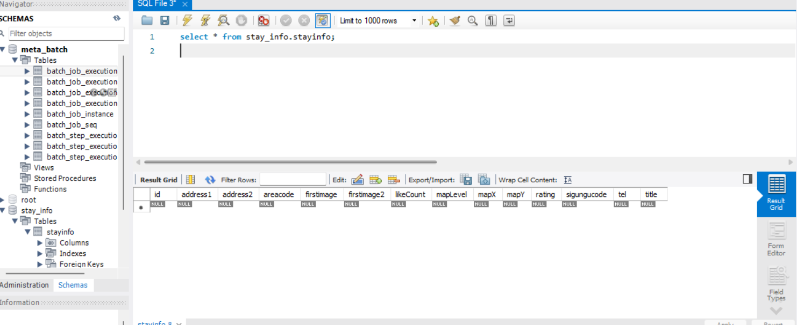
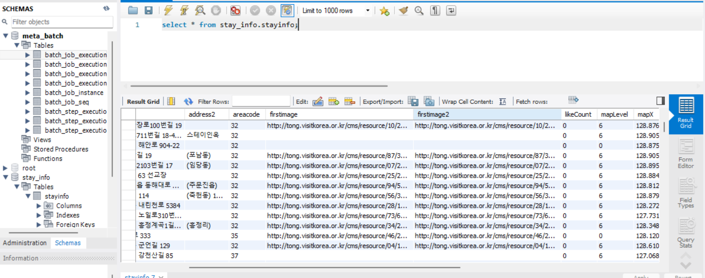
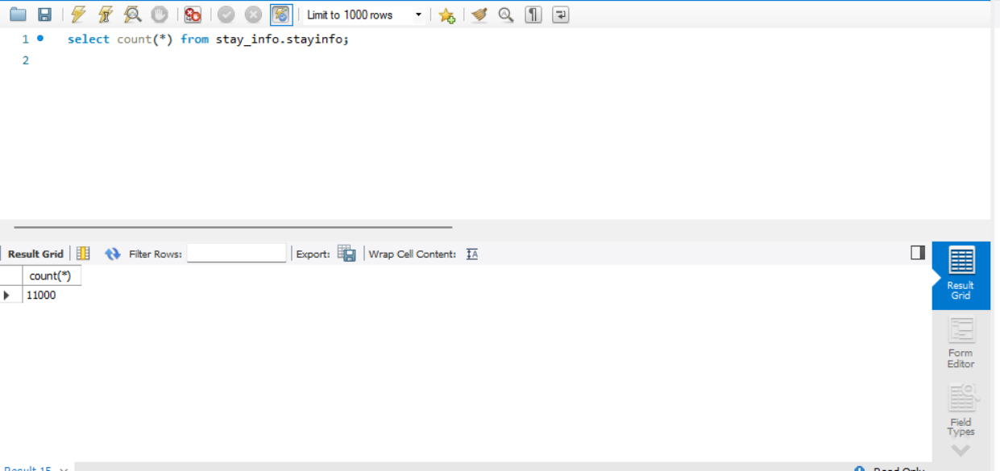

# 숙박 정보 Batch 처리

---
### 개요
    Open API을 통해 얻은 숙박 정보들을 필요한 정보만 재가공해 DB에 저장하는 애플리케이션입니다.
    Meta Data와 재가공된 Data를 나눠 처리하기 위해 실무에서 활용성이 높은 다중 DB 연결을 했습니다.
    이와 같은 애플리케이션을 개발한 배경으로는 이전 회사의 프로젝트에서 Batch를 다루긴 했었지만 
    수박 겉핡기식으로 대응한 듯 하여 Batch가 무엇인지 어떠한 원리로 동작하는지를 공부하기 위해서입니다.

---
### 개발 기간

- 2025.03.12 - 2025-03-27 (2주)

---
### 개발 환경
- Language
  - Java 17
- Framework
  - Spring Boot 3.4.3
  - Spring Batch 5.2.0
- Library
  - Spring Data JPA
  - Lombok
- DataBase
  - MySQL 8.0.37
- OS & IDE
  - Windows 11
  - IntelliJ 2024.3.5
- Open API
  - [한국관광공사_국문 관광정보 서비스](https://www.data.go.kr/tcs/dss/selectApiDataDetailView.do?publicDataPk=15101578)

---
### Batch 아키텍처

---
### 결과

> 비어 있던 테이블이 Batch 시작 이후 11,000개 레코드가 삽입된 것을 볼 수 있다.